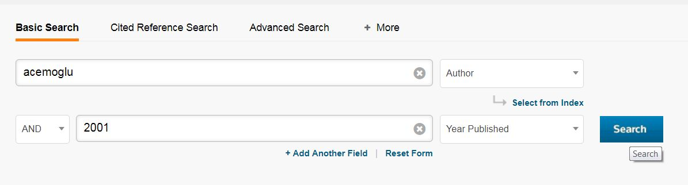
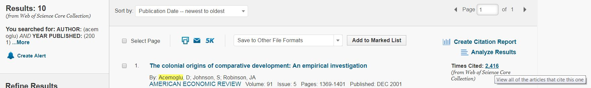
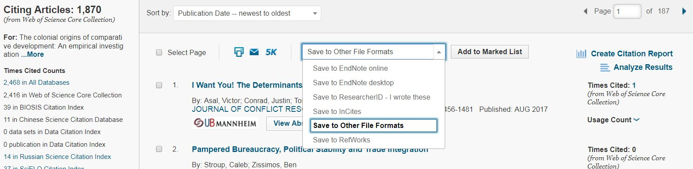
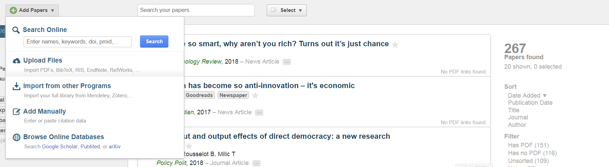

citationsr
================

-   [citationsr](#citationsr)
-   [Intro & setup](#intro-setup)
    -   [Background](#background)
    -   [Package installation](#package-installation)
    -   [Create working directory + subfolder](#create-working-directory-subfolder)
-   [Collect citation information/citations](#collect-citation-informationcitations)
    -   [Web of Science](#web-of-science)
-   [Collect fulltexts of citing documents](#collect-fulltexts-of-citing-documents)
    -   [Manual approach: Click & Save on Google Scholar](#manual-approach-click-save-on-google-scholar)
    -   [Automated approach: Fulltext package](#automated-approach-fulltext-package)
    -   [Automated approach: Paperpile](#automated-approach-paperpile)
-   [Extract citation cases from citing documents](#extract-citation-cases-from-citing-documents)
    -   [Delete duplicate PDFs](#delete-duplicate-pdfs)
    -   [Optional: Rename PDF docs before text extraction](#optional-rename-pdf-docs-before-text-extraction)
-   [Extract txt documents from pdf documents](#extract-txt-documents-from-pdf-documents)
-   [Collect metadata on citing documents and rename files accordingly](#collect-metadata-on-citing-documents-and-rename-files-accordingly)
-   [Extract citation cases](#extract-citation-cases)
    -   [Optional: Modify encoding for filenames](#optional-modify-encoding-for-filenames)
    -   [Clean text files before extraction](#clean-text-files-before-extraction)
    -   [Extract citation cases](#extract-citation-cases-1)
-   [Analysis of citation cases](#analysis-of-citation-cases)
    -   [Simple analyses](#simple-analyses)
    -   [Topic analyses](#topic-analyses)
    -   [Analyzing several dataframes with citation cases](#analyzing-several-dataframes-with-citation-cases)
-   [References](#references)

citationsr
==========

The R package `citationsr` comprises functions that can be used to extract and analyze citation cases. When study A cites study B, it contains text fragments that refer to study B. We call study A a *citing document* and the text fragments it contains *citation cases*.

This readme serves to outline the methods applied in [Bauer et al. (2016)](http://dx.doi.org/10.2139/ssrn.2874549) with contributions from [Paul C. Bauer](http://www.paulcbauer.eu/), [Pablo Barberá](http://pablobarbera.com/) and [Simon Munzert](http://simonmunzert.github.io/). The idea is to go beyond a simple and primitive analysis of impact as 'times cited'. The code is licensed under an [Attribution-NonCommercial-ShareAlike 4.0 International (CC BY-NC-SA 4.0)](https://creativecommons.org/licenses/by-nc-sa/4.0/) license.

**Disclaimer**: We currently don't have time to work on this project and **can't provide support**. But we hope to develop it further at a later stage.

If you have questions please contact us at [mail@paulcbauer.eu](mail@paulcbauer.eu).

Intro & setup
=============

Background
----------

We are interested in questions such as the following:

-   *What do others write about a particular study? Which studies engage seriously with a particular study?*

The tutorial illustrates how the code in the package `citationsr` can be used to investigate the impact of a particular study. The tutorial targets users that are <u>very familiar</u> with R. In principle, one may want to analyze the impact of a <u>single</u> or <u>several</u> studies. Most steps are common to both aims.

As described more extensively in [Bauer et al. (2016)](http://dx.doi.org/10.2139/ssrn.2874549) we need to pursue the following <u>steps</u>:

1.  **Collect citation information, i.e. which works cite our study(ies) of interest**
    -   Documents that cite a study are called *citing documents*, text passages within those documents that refer to a study are called *citation cases*.
2.  **Collect the full text of citing documents**
3.  **Convert citing documents into raw text that can be analyzed**
4.  **Collect metadata on the citing documents**
5.  **Extract citation cases from citing documents**
6.  **Analyze citation cases**

Below we present code that cycles through those steps. Essentially, we present the steps pursued in our study in which we investigate the impact of six highly cited studies in the fields of Political Science, Sociology and Economics.

Importantly, all of the above steps require methods that come with error. For intance Step 2, collecting fulltexts, contains error because we are not able to collect all fulltexts. Step 5, extracting citation cases, contains error because technically it is a challenging problem. Hence, the methods we present here are by no means perfect.

<br><br>

Package installation
--------------------

Right now you can install the package from github for which you need to install the `devtools` package.

``` r
install.packages("devtools")
library(devtools)
install_github("paulcbauer/citationsr")
```

<br><br>

Create working directory + subfolder
------------------------------------

Create a working directory in which you store all the files linked to the analysis. We created a folder called `analysis` within which most of the analysis will take place.

<br><br>

Collect citation information/citations
======================================

In principle there are several ways to do this. Here we just present one approach relying on the Web of Science. Naturally, the citation information from the Web of Science is biased in various ways, e.g. it mostly contains journal publications and not books.

<br><br>

Web of Science
--------------

It is rather easy to program an R function that scrapes websites such as the Web of Science. However, since that is not legal, we present the manual way here. The Web of Science lets you download 500 citation records at a time and you can obtain them following the steps below. Unfortunately, you need access to the Web of Science (usually trough your university).

-   Search for the study of interest 

<br><br>

-   Identify the right study in the list and click on 'Times Cited' 

<br><br>

-   Save citation records "Other File Formats" 

<br><br>

-   Choose number of records (max. 500), record content ('Author, Title, Source') and File Format ('Tab-delimited') and click send. 

<br><br>

-   Change name of downloaded file with author names, year and pages of exported records and copy the files to the `analysis/citations` folder. 


<br><br>

-   Your `analysis/citations` folder should like below. 

<br><br>

-   Use the code below to merge and store the citation records in one single data frame

<br><br>

Collect fulltexts of citing documents
=====================================

Again there are several ways to do this. We'll go with the third approach.

1.  Manual approach: Click & Save on Google Scholar
2.  Automated approach: Fulltext package
3.  Automated approach: Paperpile

<br><br>

Manual approach: Click & Save on Google Scholar
-----------------------------------------------

Go to GoogleScholar. Search for you article of interest. Click on `cited by`. Go through the articles and download those that you can access through the links on the right. Potentially, you will get more articles then by going through the citations that you get from the web of knowledge. On the other hand it's increadibly laborious.

<br><br>

Automated approach: Fulltext package
------------------------------------

The `fulltext` package and the contained function `ft_get()` by Scott Chamberlain should be able to scrape fulltexts of articles if you feed it a set of dois.

<br><br>

Automated approach: Paperpile
-----------------------------

Paperpile is a commercial reference manager (3 Euros/month for academics) that works together with Google Drive. The nice thing is that it includes a very PDF scraper (as other reference managers as well). Once you upload DOIs for the studies for which you want to collect fulltexts, paperpile does a good job at downloading them to your GoogleDrive.

To proceed we need two helper functions that are available in a package called [paperpiler](https://github.com/paulcbauer/paperpiler).

-   `paperpiler::gen_ris()` below takes a set of dois and generates a `*.ris` file that can be imported into paperpile.

-   Once you have created the ris file called, e.g. `records.ris` you can import that into paperpile. See the steps below in which you import the file and the corresponding records into a folder called `impactanalysis`. You might also want to label all records in that folder with a particular label, e.g. `impactanalysis` to keep track of them. Importantly, Paperpile only downloads articles onto your google drive that are accessible through your university network.

-   Choose "Upload Files" in the "Add Papers" menu.



<br><br>

-   Choose the "\*.ris" files an click on "open".


<br><br>

-   Check "Organize into a new folder" and give a name to the folder, e.g. "impactanalysis". Then click "Start upload".


<br><br>

-   Click on the folder "Impactanalysis" and click on the "Select" menu on "All".


<br><br>

-   In the "More actions..." menu click on "Auto-Update".


<br><br>

-   Then you update auto-update so that paperpile fetches information on those articles using the DOIs. **Importantly, publishers dislike it when you download to many articles in one batch. Take this into account as you don't want to block your university's access to those publishers. Thus, download only small batches of PDFs and potentially discuss with your library before you do that or contact the publisher directly. Paperpile provides the following warning message**:

"*You are about to start an automatic bulk download of 9428 papers. If too many papers in your library are from a single publisher, your computer might get temporarily blocked from access to the publisher's website. Also, if many of your papers have incomplete meta-data your computer might get blocked by Google Scholar because Paperpile make too many requests to find the missing data. Although temporary blocks are rare and not a big problem, please consider downloading the PDFs in smaller batches.*"


<br><br>

-   Subsequently, you collect the PDFs which then sit in the paperpile folder on your computer. Click on the "More actions..." menu on "Download PDFs".


<br><br>

-   Once, you have pursued these steps all the PDFs will be stored in your Paperpile folder on your GoogleDrive. Now, we need to fetch those files and copy them to a folder in which you analyze them.
-   `paperpiler::fetch_docs()` relies on the dataframe `citation_data` that we generated from the web of knowledge and searches through your paperpile directory. I tries to identify files through their title and if that does not work through an author/year combination. It's fuzzy so it may fetch more docs then necessary.

-   Make sure that the PDF documents are in the folder you specified in the "to" argument after you collected their fulltexts.

<br><br>

Extract citation cases from citing documents
============================================

Delete duplicate PDFs
---------------------

Paperpile allows you to store several versions of an articles. Normally, these are marked with "(1)", "(2)" etc. in their file names. Use the code below to delete any duplicate files that you fetched from the Paperpile folder.

Optional: Rename PDF docs before text extraction
------------------------------------------------

**Skip this step**. Sometimes it's a good idea to rename the PDFs files before you analyze them. The function below simply searches for all PDF documents in the folder and renames them from `1.pdf` to `*.pdf`.

<br><br>

Extract txt documents from pdf documents
========================================

Now, we need to extract text from those PDFs to analyze them. Here you can use the `extract_text()` function. The argument `from` specifies the folder in which the documents are located. `number` can be omitted or specified to limit the number of documents for which you want to extract text (e.g. for testing extraction for a few documents starting with the first).

-   The function relies an an open-source PDF text extraction tool called "pdftotext.exe" from [XPDF](https://www.xpdfreader.com/download.html). Download the Xpdf tools for your system, extract the .zip file and copy `pdftotext.exe`. You have to indicate the path to `pdftotext.exe` in the `extract_text()` function.

-   You can rerun this function. Before extraction it will automatically delete all `*.txt` that are present in the folder specified in `to  =`. If the folder does not exist it will create it.

<br><br>

Collect metadata on citing documents and rename files accordingly
=================================================================

Above we started with citation data from the Web of Science. There might be cases where we just have text documents or PDFs but we don't have any more information on them. The function `get_metadata()` analyzes the text documents in the folder specified by `from =` and tries to identify them (relying on the DOIs the contain). Crossref does not like it if you scrape metada for too many docs at once. So ideally execute the function for batches of files be specifying `start =` and `end =`.

-   Importantly, identifying articles through their text is a hard problem and may fail for several reasons such as...
    -   ...no DOI in the text
    -   ...other DOIs in the text
    -   ...DOI not recognized by crossref
-   Beware: Crossref may limit the requests you can make. We included a possibility to restrict metadata collection to a subset of the files in the `doc_text` folder. Simply, by specifying the rank of the first end last file for which you would like to collect metadata through `start =` and `end =`.

<br><br>

Extract citation cases
======================

Optional: Modify encoding for filenames
---------------------------------------

If now strange encoding appears in your files you can safely ignore this encoding issues. However, sometimes this may be necessary. We worked on both Windows PCs and Macs and sometimes ran into encoding issues.

<br><br>

Clean text files before extraction
----------------------------------

The extraction of citation cases works better in a .txt file in which the text is not interrupted by running heads, page number etc. Below we provide two functions that try to clean the text at least to some extent.

-   `delete_refs_n_heads()` deletes references and running headers (e.g. author names on every page). It relies on the metadata that was collected before through `get_metadata()`
    -   A file `deleted_running_headers.html` is stored in your working directory that includes all the lines that were deleted from the .txt files.
-   `clean_text()` replaces any dots that are not punctuation marks among other things. For instance, it converts abbrevations, e.g. "No." to "NUMBER". It also produces a text without linebreaks.

<br><br>

Extract citation cases
----------------------

The `extract_citation_cases()` function cycles through files ending on `_processed.txt` in the `from` folder and extracts citation cases. It writes both html (for easy lookup) and csv (for analyses later) to the `to` folder that are named according to the study whose impact we study, e.g. `AcemogluJohnsonRobinson_2001_citation_cases.html` and `AcemogluJohnsonRobinson_2001_citation_cases.csv`.

Above we only looked at a single study. In our paper we investigate the impact of six studies. We stored the information on those six studies - such as authors and publication year - in a text file called `publicationdata.txt` and load this information for a starter.

We loop over the info in `publicationdata.txt` and extract the citation cases below. For each of the six studies it produces html and csv files with the citation cases.

<br><br>

Analysis of citation cases
==========================

After citation case extraction we end up with a dataframe in which the rows are citations cases (in our case 6 dataframes for 6 studies). The columns are different variables that contain information such as...

-   `document`: Contains the path and name of the file that was subject to extraction
-   `citation.case`: Contains the extracted citation case/text fragment
-   `year`: Contains the publication year of the citing document
-   `nchar.citation.case`: Contains the number of characters of the citation case

From hereon you can apply any methods you like to analyze the citation case data.

We also programmed some functions to automate the process of analysis.

<br><br>

-   Start by creating one or several output folder in which you store the results of the analysis. Below we do so for a single study.

<br><br>

Simple analyses
---------------

-   The `analyze_citations()` produces some simple analyses/graphs of the citation cases.

<br><br>

Topic analyses
--------------

-   The `topic_analysis()` performs some topic analysis on the citation cases.

<br><br>

Analyzing several dataframes with citation cases
------------------------------------------------

Just as we extracted the citation cases referring to several studies with a loop above we can also apply the two analysis functions within a loop.

References
==========
